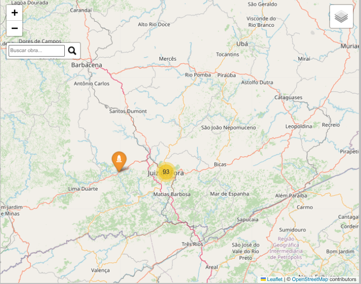

# Patrimônio histórico de Juiz de Fora

Desenvolvemos um projeto em Python para mapear os bens tombados do patrimônio histórico de Juiz de Fora, Minas Gerais. 
Utilizamos técnicas de web scraping, processamento de dados e visualização geográfica, para criar um mapa interativo que 
facilita a exploração dos marcos culturais do município.

### Importamos as bibliotecas

``` python
import numpy as np
import pandas as pd
import osmnx as ox
import requests
from bs4 import BeautifulSoup
import os
from groq import Groq
from PyPDF2 import PdfReader
import tempfile
import base64
import re
import folium
from folium.plugins import Search, MarkerCluster 
import json

from dotenv import load_dotenv
```

### Baixamos a lista

Extraímos os dados da Wikipedia, onde existe uma lista completa dos bens tombados na cidade.
Utilizamos a biblioteca *BeautifulSoup* para analisar o HTML e extrair as informações da tabela.
Ao mesmo tempo, convertemos as coordenadas no formato DMS (graus, minutos, segundos) para decimal.

``` python
def extrair_bens_tombados():
    url = "https://pt.wikipedia.org/wiki/Lista_de_bens_tombados_em_Juiz_de_Fora" 
    response = requests.get(url)
    soup = BeautifulSoup(response.text, 'html.parser')

    table = soup.find('table', {'class': 'wikitable'})
    bens_list = []

    for row in table.find_all('tr')[1:]:
        cols = row.find_all(['td', 'th'])
        if len(cols) >= 5:
            nome_bem = cols[1].get_text(strip=True)
            coord_texto = cols[3].get_text(strip=True)

            try:
                lat, lon = extrair_coordenadas(coord_texto)
                if lat is not None and lon is not None:
                    bens_list.append({
                        'Bem': nome_bem,
                        'Latitude': lat,
                        'Longitude': lon
                    })
            except Exception as e:
                print(f"Erro ao processar linha: {e}")
                continue

    return bens_list

def extrair_coordenadas(texto):
    if not texto.strip():
        return None, None

    try:
        partes = texto.split(',')
        if len(partes) < 2:
            return None, None

        lat_str = partes[0].strip()
        lon_str = partes[1].strip()

        def dms_para_decimal(dms):
            dms = dms.replace('°', ' ').replace('′', ' ').replace('″', '').strip()
            graus, minutos, segundos = map(float, dms.split()[:3])
            direcao = dms.split()[-1]

            decimal = abs(graus) + minutos / 60 + segundos / 3600
            if direcao in ['S', 'O']:
                decimal *= -1

            return decimal

        lat = dms_para_decimal(lat_str)
        lon = dms_para_decimal(lon_str)

        return lat, lon
    except Exception as e:
        print(f"Erro ao processar coordenada: {texto} - {e}")
        return None, None

# Extração dos dados
bens = extrair_bens_tombados()
```

### Convertemos a lista em dataframe

``` python
df = pd.DataFrame(bens)
df.to_csv("bens_tombados_jf.csv", index=False, sep=";", encoding="utf-8")
```

### Inspecionamos o dataframe

``` python
print(df.head())
```

``` python
                                                     Bem   Latitude  Longitude
    0  Acervo documental do "Fundo Câmara Municipal d... -21.755278 -43.344167
    1                                   Agência Bradesco -21.761111 -43.348056
    2                                   Agência Bradesco -21.761111 -43.348056
    3                                     Alfândega Seca -21.761389 -43.343056
    4                  Antiga Diretoria de Higiene – DCE -21.758611 -43.348889
```

``` python
df.shape
```

    (140, 3)

``` python
print(df.isnull().sum())
```

    Bem          0
    Latitude     0
    Longitude    0
    dtype: int64

``` python
df.isna().sum()
```

    Bem          0
    Latitude     0
    Longitude    0
    dtype: int64

### Limpeza de dados

**Removemos as linhas com valores em branco, nulos ou faltantes:**

``` python
df = df.replace(['', np.nan], np.nan).dropna()
print(df.head())
```

``` python
                                                     Bem   Latitude  Longitude
    0  Acervo documental do "Fundo Câmara Municipal d... -21.755278 -43.344167
    1                                   Agência Bradesco -21.761111 -43.348056
    2                                   Agência Bradesco -21.761111 -43.348056
    3                                     Alfândega Seca -21.761389 -43.343056
    4                  Antiga Diretoria de Higiene – DCE -21.758611 -43.348889
```

**Removemos as linhas duplicadas:**

``` python
df = df.drop_duplicates()
print(df.head())
```

``` python
                                                     Bem   Latitude  Longitude
    0  Acervo documental do "Fundo Câmara Municipal d... -21.755278 -43.344167
    1                                   Agência Bradesco -21.761111 -43.348056
    3                                     Alfândega Seca -21.761389 -43.343056
    4                  Antiga Diretoria de Higiene – DCE -21.758611 -43.348889
    5    Antiga Estação Ferroviária da Central do Brasil -22.903611 -43.191111
```

**Removemos a primeiro registro, pois não se trata de um bem imóvel:**

``` python
df = df.iloc[1:]
print(df.head())
```

``` python
                                                   Bem   Latitude  Longitude
    1                                 Agência Bradesco -21.761111 -43.348056
    3                                   Alfândega Seca -21.761389 -43.343056
    4                Antiga Diretoria de Higiene – DCE -21.758611 -43.348889
    5  Antiga Estação Ferroviária da Central do Brasil -22.903611 -43.191111
    6      Antiga Estação Ferroviária de Santos Dumont -21.455833 -43.549722
```

**Criamos o dataframe contendo os bens rotulados:**

``` python
df_temp = df[~df['Bem'].str.contains('Imóvel', case=False)]
print(df_temp.head())
```

``` python
                                                   Bem   Latitude  Longitude
    1                                 Agência Bradesco -21.761111 -43.348056
    3                                   Alfândega Seca -21.761389 -43.343056
    4                Antiga Diretoria de Higiene – DCE -21.758611 -43.348889
    5  Antiga Estação Ferroviária da Central do Brasil -22.903611 -43.191111
    6      Antiga Estação Ferroviária de Santos Dumont -21.455833 -43.549722
```

### Filtramos os bens com denominação genérica

``` python
df_imovel = df[df['Bem'].str.contains('Imóvel', case=False)]
print(df_imovel.head())
```

``` python
                                                  Bem   Latitude  Longitude
    60  Imóvel à Avenida Barão do Rio Branco, nº 3029 -21.768333 -43.347222
    61  Imóvel à Avenida Barão do Rio Branco, nº 3146 -21.769722 -43.347778
    62  Imóvel à Avenida Barão do Rio Branco, nº 3263 -21.770556 -43.346944
    63  Imóvel à Avenida Barão do Rio Branco, nº 3408 -21.771944 -43.347222
    64               Imóvel à Avenida Brasil, nº 2001 -21.758889 -43.343889
```

### Utilizamos modelo de linguagem para manipular arquivo pdf

Nesta etapa, manipulamos a lista de bens tombados, atualizada em 24/08/2021,
disponibilizada pela **FUNALFA** - Fundação Cultural Alfredo Ferreira Lage,
no formato pdf, para extrair uma tabela com dados úteis para atualizar os bens
com denominação genérica, tanto quanto possível.

``` python
# Carregamos a chave API da Groq
load_dotenv()

# Configuração inicial
GROQ_API_KEY = os.getenv("GROQ_API_KEY") 
MODEL_NAME = "meta-llama/llama-4-maverick-17b-128e-instruct"  
PDF_PATH = "bens_tombados_17092021.pdf"

# Função para extrair texto do PDF
def extract_text_from_pdf(pdf_path):
    text = ""
    with open(pdf_path, "rb") as f:
        reader = PdfReader(f)
        for page in reader.pages:
            text += page.extract_text() + "\n"
    return text

# Função para processar o texto com o LLM
def process_with_groq(text_content):
    client = Groq(api_key=GROQ_API_KEY)
    
    prompt = f"""
    Você é um assistente especializado em extrair dados estruturados de documentos. 
    Extraia uma tabela com os bens tombados do seguinte texto, com três colunas:
    1. id (número sequencial)
    2. endereço (se disponível)
    3. nome_edificio (descrição do bem tombado)

    Formato esperado:
    id | endereço | nome_edificio
    ---|----------|-------------
    1  | Rua X, 123 | Edifício ABC

    Texto para análise:
    {text_content}
    """

    response = client.chat.completions.create(
        messages=[{"role": "user", "content": prompt}],
        model=MODEL_NAME,
        temperature=0.3
    )
    
    return response.choices[0].message.content

# Função para converter a resposta em DataFrame
def parse_response_to_df(response_text):
    lines = [line.split('|') for line in response_text.strip().split('\n') if '|' in line]
    
    # Remover cabeçalho se existir
    if 'id' in lines[0][0].lower():
        lines = lines[1:]
    
    data = []
    for line in lines:
        # Limpar cada campo
        cleaned = [item.strip() for item in line]
        
        # Garantir que temos 3 colunas
        if len(cleaned) == 3:
            data.append({
                'id': cleaned[0],
                'endereco': cleaned[1],
                'nome_edificio': cleaned[2]
            })
    
    return pd.DataFrame(data)

# Fluxo principal
def main():
    # Extrair texto do PDF
    print("Extraindo texto do PDF...")
    text_content = extract_text_from_pdf(PDF_PATH)
    
    # Processar com Groq
    print("Processando com o modelo LLM...")
    response = process_with_groq(text_content)
    
    # Converter para DataFrame
    print("Convertendo para DataFrame...")
    df_funalfa = parse_response_to_df(response)
    
    # Salvar como CSV
    output_path = "bens_tombados.csv"
    df_funalfa.to_csv(output_path, index=False, encoding='utf-8-sig')
    print(f"Dados salvos em {output_path}")
    
    # Mostrar preview
    print("\nPreview dos dados:")
    print(df_funalfa.head())

if __name__ == "__main__":
    main()
```

### Extraímos uma amostra do dataframe

``` python
df_tombados = pd.read_csv("bens_tombados.csv")
print(df_tombados.head())
```

``` python
        id                                     endereco  \
    0  ---                                   ----------   
    1    1                             Rua Halfeld, s/n   
    2    2                   Praça Dr. João Pessoa, s/n   
    3    3                           Parque e Acervo do   
    4    4  Rua Espírito Santo, 467 e Usina de Marmelos   

                                           nome_edificio  
    0                                      -------------  
    1   Edifício do antigo Fórum, atual Câmara Municipal  
    2                               Cine Theatro Central  
    3                             Museu Mariano Procópio  
    4  Remanescentes das antigas instalações da Cia. ...  
```

### Removemos os registros em branco

``` python
df_tombados_filtrado = df_tombados.dropna()
print(df_tombados_filtrado.head())
```

``` python
        id                                     endereco  \
    0  ---                                   ----------   
    1    1                             Rua Halfeld, s/n   
    2    2                   Praça Dr. João Pessoa, s/n   
    3    3                           Parque e Acervo do   
    4    4  Rua Espírito Santo, 467 e Usina de Marmelos   

                                           nome_edificio  
    0                                      -------------  
    1   Edifício do antigo Fórum, atual Câmara Municipal  
    2                               Cine Theatro Central  
    3                             Museu Mariano Procópio  
    4  Remanescentes das antigas instalações da Cia. ...  
```

### Atribuímos nomes específicos aos registros genéricos

Implementamos rotina para unir os dados da Wikipedia com os dados da **FUNALFA**,
através da correspondência de endereços:

``` python
# Função para padronizar endereços
def padronizar_endereco(endereco):
    # Remover "Imóvel à " e "nº"
    endereco = re.sub(r'Imóvel à ', '', endereco)
    endereco = re.sub(r'nº ', '', endereco)
    endereco = re.sub(r'nº', '', endereco)
    
    # Padronizar Av. vs Avenida
    endereco = re.sub(r'Av\.', 'Avenida', endereco)
    
    # Remover espaços extras e vírgulas desnecessárias
    endereco = re.sub(r'\s+', ' ', endereco).strip()
    endereco = re.sub(r',\s*$', '', endereco)
    
    # Padronizar números (ex: "nº 711" -> "711")
    endereco = re.sub(r'(\D)(\d+)', lambda m: f"{m.group(1).strip()} {m.group(2)}", endereco)
    
    return endereco.strip()

# Função para extrair a parte do endereço que usaremos para matching
def extrair_chave_endereco(endereco):
    # Extrair tipo (Rua/Avenida/Praça) e nome
    match = re.match(r'(Rua|Avenida|Praça|Estrada)\s+(.+)$', endereco)
    if match:
        tipo = match.group(1)
        resto = match.group(2)
        
        # Extrair número se existir
        num_match = re.search(r'(\d+)(?:\D|$)', resto)
        numero = num_match.group(1) if num_match else None
        
        # Construir chave
        if numero:
            return f"{tipo} {resto.split(',')[0].strip()}, {numero}"
        return f"{tipo} {resto.split(',')[0].strip()}"
    return endereco

# Atualizar df_imovel com os nomes dos edifícios
def atualizar_bens_tombados(df, df_imovel):
    # Criar cópias para não modificar os originais
    df_clean = df.copy()
    df_imovel_clean = df_imovel.copy()
    
    # Padronizar endereços em ambos DataFrames
    df_imovel_clean['endereco_padrao'] = df_imovel_clean['Bem'].apply(padronizar_endereco)
    df_imovel_clean['chave_endereco'] = df_imovel_clean['endereco_padrao'].apply(extrair_chave_endereco)
    
    df_clean['endereco_padrao'] = df_clean['endereco'].fillna('').apply(padronizar_endereco)
    df_clean['chave_endereco'] = df_clean['endereco_padrao'].apply(extrair_chave_endereco)
    
    # Criar dicionário de mapeamento (chave_endereco -> nome_edificio)
    mapeamento = df_clean.set_index('chave_endereco')['nome_edificio'].to_dict()
    
    # Atualizar o campo 'Bem' no df_imovel
    def atualizar_nome(row):
        chave = row['chave_endereco']
        if chave in mapeamento and pd.notna(mapeamento[chave]):
            return mapeamento[chave]
        return row['Bem']  # Manter o original se não encontrar
    
    df_imovel_clean['Bem'] = df_imovel_clean.apply(atualizar_nome, axis=1)
    
    # Remover colunas temporárias
    df_imovel_clean.drop(columns=['endereco_padrao', 'chave_endereco'], inplace=True)
    
    return df_imovel_clean

# Exemplo de uso:
# Supondo que df (do PDF) e df_imovel já existam como DataFrames

# Carregar os DataFrames (exemplo)
df = df_tombados_filtrado.copy()

# Atualizar o DataFrame
df_imovel_atualizado = atualizar_bens_tombados(df, df_imovel)

# Mostrar resultado
print("DataFrame atualizado:")
print(df_imovel_atualizado)

# Salvar em CSV se necessário
df_imovel_atualizado.to_csv('imoveis_atualizados.csv', index=False, encoding='utf-8-sig')
```

### Filtramos o dataframe atualizado

``` python
df_imovel_nomeado = df_imovel_atualizado[~df_imovel_atualizado['Bem'].str.contains('Imóvel', case=False)]
print(df_imovel_nomeado)
```

``` python    Bem   Latitude  Longitude
61                                    Círculo Militar -21.769722 -43.347778
62                                 Residência Colucci -21.770556 -43.346944
64                          Núcleo Histórico da RFFSA -21.758889 -43.343889
70                           Antigo Mercado Municipal -21.754444 -43.352222
73                                  Fazenda da Tapera -21.738056 -43.360833
92                                              CEMIG -21.742222 -43.373889
94  Colégio Cristo Redentor, antiga Academia de Co... -21.762500 -43.353056
95                                    Banco do Brasil -21.760278 -43.346111
96                              Banco de Crédito Real -21.760556 -43.346667
97                                        Cine Palace -21.760833 -43.346944
```

### Unificamos os dataframes

``` python
df_imovel_nomeado = df_imovel_nomeado.iloc[:-1]
df_bens = pd.concat([df_temp, df_imovel_nomeado], axis=0)
print(df_bens.head())
```

``` python
                                                   Bem   Latitude  Longitude
    1                                 Agência Bradesco -21.761111 -43.348056
    3                                   Alfândega Seca -21.761389 -43.343056
    4                Antiga Diretoria de Higiene – DCE -21.758611 -43.348889
    5  Antiga Estação Ferroviária da Central do Brasil -22.903611 -43.191111
    6      Antiga Estação Ferroviária de Santos Dumont -21.455833 -43.549722
```

### Convertemos o dataframe final em dicionário

``` python
bens = df_bens.to_dict('records')
```

### Visualizamos os dados em um mapa interativo

``` python

if not bens:
    print("Nenhum bem foi extraído. Verifique a estrutura da tabela na página.")
else:
    # Criar mapa base centrado em Juiz de Fora
    museu_mapa = folium.Map(location=[-21.7625, -43.35], zoom_start=13)

    # Estrutura GeoJSON para armazenar os bens (apenas para busca)
    obras_geojson = {
        "type": "FeatureCollection",
        "features": []
    }

    # Criar FeatureGroup para os marcadores visíveis
    bens_group = folium.FeatureGroup(name="Bens Tombados", show=True)

    # Preencher o GeoJSON e adicionar marcadores visíveis
    for item in bens:
        nome = item['Bem']
        lat = item['Latitude']
        lon = item['Longitude']

        if lat is not None and lon is not None:
            # Adicionar ao GeoJSON (para busca)
            obras_geojson["features"].append({
                "type": "Feature",
                "properties": {"nome": nome},
                "geometry": {
                    "type": "Point",
                    "coordinates": [lon, lat]
                }
            })

            # Adicionar marcador visível ao FeatureGroup
            folium.Marker(
                location=[lat, lon],
                popup=nome,
                icon=folium.Icon(color="orange", icon="monument", prefix="fa")
            ).add_to(bens_group)

    # Adicionar o FeatureGroup ao mapa
    bens_group.add_to(museu_mapa)

    # Criar camada GeoJSON oculta apenas para busca
    geojson_layer = folium.GeoJson(
        obras_geojson,
        name="GeoJSON Busca",
        style_function=lambda x: {
            'fillOpacity': 0,  # Totalmente transparente
            'opacity': 0,      # Totalmente transparente
            'radius': 0        # Tamanho zero
        },
        marker=folium.Circle(radius=0),  # Marcador invisível
        control=False  # Não aparece no controle de camadas
    ).add_to(museu_mapa)

    # Configurar o plugin de busca na camada GeoJSON oculta
    search_plugin = Search(
        layer=geojson_layer,
        search_label="nome",
        placeholder="Buscar obra...",
        collapsed=False,
        position='topleft'
    ).add_to(museu_mapa)

    # Adicionar controle de camadas
    folium.LayerControl().add_to(museu_mapa)

    # Salvar mapa
    museu_mapa.save("mapa_bens_tombados_jf.html")
```


### Agrupamos os dados em um mapa interativo

Quando há muitos pontos de dados, convém utilizar a função de agrupamento,
para melhorar a visibilidade e evitar a sobrecarga.

``` python
if not bens:
    print("Nenhum bem foi extraído. Verifique a estrutura da tabela na página.")
else:
    # Criar mapa base centrado em Juiz de Fora
    museu_mapa = folium.Map(location=[-21.7625, -43.35], zoom_start=13)

    # Criar um MarkerCluster para agrupar os marcadores
    marker_cluster = MarkerCluster(
        name="Bens Tombados",
        overlay=True,
        control=True,
        options={'maxClusterRadius': 40}
    ).add_to(museu_mapa)

    # Estrutura GeoJSON para armazenar os bens (apenas para busca)
    obras_geojson = {
        "type": "FeatureCollection",
        "features": []
    }

    # Preencher o GeoJSON e adicionar marcadores ao cluster
    for item in bens:
        nome = item['Bem']
        lat = item['Latitude']
        lon = item['Longitude']

        if lat is not None and lon is not None:
            # Adicionar ao GeoJSON (para busca)
            obras_geojson["features"].append({
                "type": "Feature",
                "properties": {"nome": nome},
                "geometry": {
                    "type": "Point",
                    "coordinates": [lon, lat]
                }
            })

            # Adicionar marcador ao cluster
            folium.Marker(
                location=[lat, lon],
                popup=nome,
                icon=folium.Icon(color="orange", icon="monument", prefix="fa")
            ).add_to(marker_cluster)

    # Criar camada GeoJSON oculta apenas para busca
    geojson_layer = folium.GeoJson(
        obras_geojson,
        name="GeoJSON Busca",
        style_function=lambda x: {
            'fillOpacity': 0,  # Totalmente transparente
            'opacity': 0,      # Totalmente transparente
            'radius': 0        # Tamanho zero
        },
        marker=folium.Circle(radius=0),  # Marcador invisível
        control=False  # Não aparece no controle de camadas
    ).add_to(museu_mapa)

    # Configurar o plugin de busca na camada GeoJSON oculta
    search_plugin = Search(
        layer=geojson_layer,
        search_label="nome",
        placeholder="Buscar obra...",
        collapsed=False,
        position='topleft'
    ).add_to(museu_mapa)

    # Adicionar controle de camadas
    folium.LayerControl().add_to(museu_mapa)

    # Salvar mapa
    museu_mapa.save("cluster_bens_tombados_jf.html")
```


### Filtramos os pontos dentro do polígono de Juiz de Fora

Para assegurar que todos os pontos de dados estejam dentro da área de interesse,
aplicamos um filtro para extrair somente os bens tombados restritos ao polígono
do município.


``` python
# Obter os limites de Juiz de Fora
place = 'Juiz de Fora, MG, Brasil'
gdf = ox.geocoder.geocode_to_gdf(place)

# Extrair as coordenadas da bounding box (bbox)
bbox = gdf.iloc[0][['bbox_west', 'bbox_south', 'bbox_east', 'bbox_north']].values

# Criar o dicionário no formato desejado
JF_BOUNDS = {
    'min_lat': float(bbox[1]),  # bbox_south
    'max_lat': float(bbox[3]),  # bbox_north
    'min_lon': float(bbox[0]),  # bbox_west
    'max_lon': float(bbox[2])   # bbox_east
}

def dentro_dos_limites(lat, lon):
    return (JF_BOUNDS['min_lat'] <= lat <= JF_BOUNDS['max_lat'] and
            JF_BOUNDS['min_lon'] <= lon <= JF_BOUNDS['max_lon'])


if not bens:
    print("Nenhum bem foi extraído. Verifique a estrutura da tabela na página.")
else:
    # Filtrar bens que estão dentro dos limites de JF
    bens_filtrados = [item for item in bens 
                     if item['Latitude'] is not None 
                     and item['Longitude'] is not None
                     and dentro_dos_limites(item['Latitude'], item['Longitude'])]
    
    # Criar mapa base centrado em Juiz de Fora
    museu_mapa = folium.Map(location=[-21.7625, -43.35], zoom_start=13)

    # Criar um MarkerCluster para agrupar os marcadores
    marker_cluster = MarkerCluster(
        name="Bens Tombados",
        overlay=True,
        control=True,
        options={'maxClusterRadius': 40}
    ).add_to(museu_mapa)

    # Estrutura GeoJSON para armazenar os bens (apenas para busca)
    obras_geojson = {
        "type": "FeatureCollection",
        "features": []
    }

    # Preencher o GeoJSON e adicionar marcadores ao cluster
    for item in bens_filtrados:
        nome = item['Bem']
        lat = item['Latitude']
        lon = item['Longitude']

        # Adicionar ao GeoJSON (para busca)
        obras_geojson["features"].append({
            "type": "Feature",
            "properties": {"nome": nome},
            "geometry": {
                "type": "Point",
                "coordinates": [lon, lat]
            }
        })

        # Adicionar marcador ao cluster
        folium.Marker(
            location=[lat, lon],
            popup=nome,
            icon=folium.Icon(color="orange", icon="monument", prefix="fa")
        ).add_to(marker_cluster)

    # Criar camada GeoJSON oculta apenas para busca
    geojson_layer = folium.GeoJson(
        obras_geojson,
        name="GeoJSON Busca",
        style_function=lambda x: {
            'fillOpacity': 0,
            'opacity': 0,
            'radius': 0
        },
        marker=folium.Circle(radius=0),
        control=False
    ).add_to(museu_mapa)

    # Configurar o plugin de busca
    search_plugin = Search(
        layer=geojson_layer,
        search_label="nome",
        placeholder="Buscar obra...",
        collapsed=False,
        position='topleft'
    ).add_to(museu_mapa)

    # Adicionar controle de camadas
    folium.LayerControl().add_to(museu_mapa)

    # Salvar mapa
    museu_mapa.save("cluster_bens_tombados_jf_1.html")
    print(f"Mapa salvo com {len(bens_filtrados)} bens tombados dentro dos limites de JF")
```



### Considerações finais

Para tornar o mapa mais funcional, utilizamos a função de *clustering* do pacote **folium**,
que agrupa marcadores próximos, melhorando a visualização em áreas com muitos pontos. 
Além disso, integramos um *plugin* de busca, para permitir a localização de bens tombados
diretamente pelo nome, no mapa.

O objetivo do projeto foi mostrar como a ciência de dados pode apoiar a preservação e 
divulgação do patrimônio cultural, através da transformação de informações brutas 
em ferramentas úteis.

Os mapas interativos gerados podem ser abertos em qualquer navegador — basta fazer o download dos arquivos em formato HTML.


